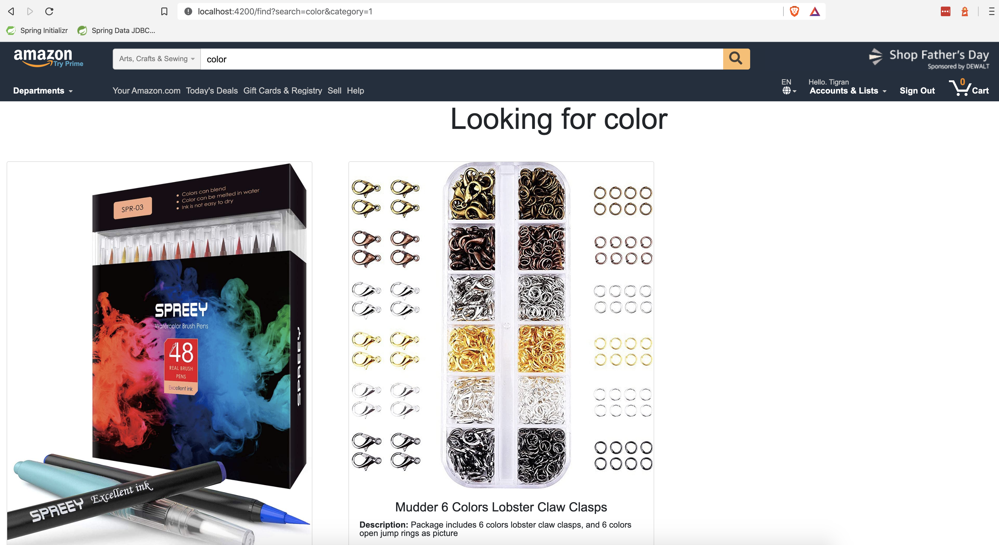

# Demo Java Application

A web shoo project, demonstrating integration of Java based backend REST API and Angular in frontend. 

## Screenshot


## Technology Stacks
**Backend**
  - Java 11
  - Spring Boot 2.2
  - Spring Security
  - JWT Authentication
  - Spring Data JPA
  - Hibernate
  - PostgreSQL
  - Maven

**Frontend**
  - Angular 7
  - Bootstrap

## How to  Run

**Backend**

  1. Install [PostgreSQL](https://www.postgresql.org/download/) 
  2. Configure datasource in `application.yml`.
  3. `cd backend`.
  4. Run `mvn install`.
  5. Run `mvn spring-boot:run`.
  7. The backend server is running on [localhost:8080]().

**Frontend**
  1. Install [Node.js and npm](https://www.npmjs.com/get-npm)
  2. `cd frontend`.
  3. Run `npm install`.
  4. Run `ng serve`
  5. The frontend client is running on [localhost:4200]().

#### Run in Docker
You can build the image and run the container with Docker. 
1. Build backend project
```bash
cd backend
mvn package
```
2. Build fontend project
```bash
cd frontend
npm install
ng build --prod
```
3. Build images and run containers
```bash
docker-compose up --build
```